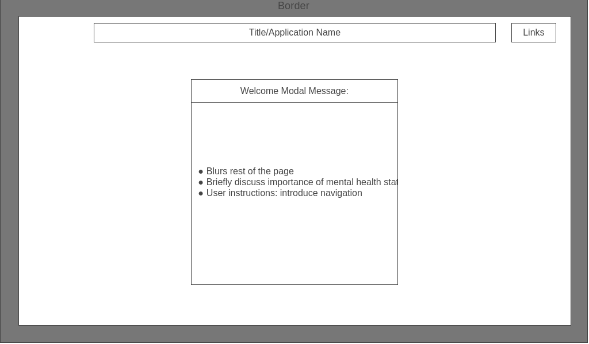

# State Stats
## Background
United Stats of America is a 2D choropleth map data visualization that represents mental health statistics by state for the U.S.A. Even with prior knowledge of statistics, interpretation of the figures and values is somewhat hindered by technical jargon in that numerical data is not always easily readable. This project provides a way to intuitively navigate statistical data from state-to-state across the United States. The map is rendered using JSON data that is fetched from [topojson/US-Atlas](https://github.com/topojson/us-atlas), and each state's color is filled depending on statistical data from [Substance Abuse and Mental Health Services Administration's (SAMSHA) National Survey on Drug Use and Health (NSDUH) 2018-2019 data](https://www.samhsa.gov/data/data-we-collect/nsduh-national-survey-drug-use-and-health).

[Live link!](https://g-hor.github.io/united_stats_of_america/)

## Functionality & MVPs
In United Stats of America, users will be able to:

* view affected populations of mental health statistics through color schemes
* select different categories mental health statistics
* view a selected state's raw population count for the selected condition and a proportional (percent) value for the selected condition
* zoom in and view state-specific data by clicking on individual states

In addition, this project will include:

* Definitive and conceptual context to explain the practical significance of different statistics
* A production README

## Wireframes

## Technologies, Libraries, APIs
* Vanilla Javascript
* D3.js library
* Data fetched locally from CSV files

## Implementation Timeline
* Friday Afternoon & Weekend: Research D3.js and implement U.S. map with individual states geography data
* Monday: Clean/parse local CSV data and implement chloropeth feature
* Tuesday: Create legend and refactor code to handle fetches from variable CSV files
* Wednesday: Create modal for user instructions and refine webpage styling
* Thursday Morning: Create state-based statistical data modal and finalize styling